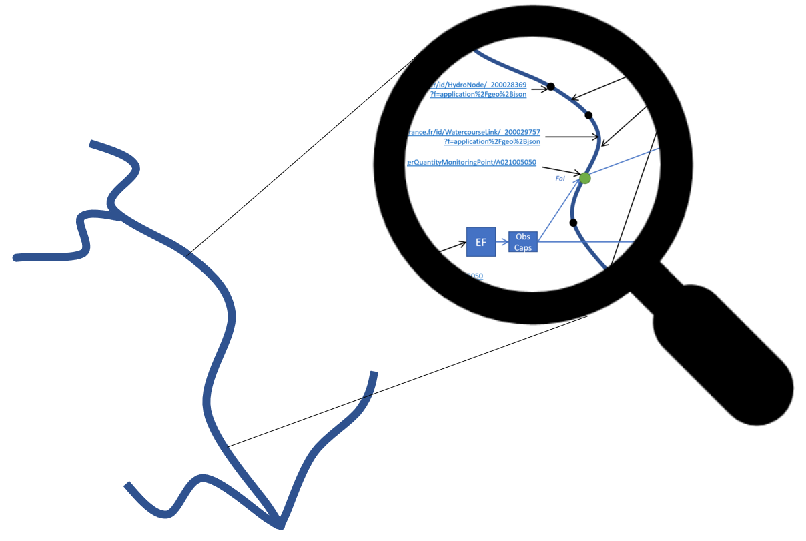

# API4INSPIRE

## Surface water
### API endpoint
Hydro Features API : https://iddata.eaufrance.fr/api/hydroFAPI/ogc/features/collections/

As each element (feature instance) is assigned a URI it can either be accessed through
- its URI (+ content negociation): https://iddata.eaufrance.fr/id/HydroStation/A021005050?f=application%2Fgeo%2Bjson
- or via the corresponding request in the API : https://iddata.eaufrance.fr/api/hydroFAPI/ogc/features/collections/ef:EnvironmentalMonitoringFacility/items/A021005050?f=application%2Fgeo%2Bjson

### A nice example
From an HydroStation (ex: https://iddata.eaufrance.fr/id/HydroStation/A021005050?f=application%2Fgeo%2Bjson)  you are able
- to traverse to the WaterCourseLinkSequence (also points back to WaterCourse)
  - then the WaterCourse
  - or the WaterCourseLink then HydroNode. The WaterCourseLink points back to the WaterCourseLinkSequence it belongs to.
- to access the corresponding ST API Datastreams (using hasObservation)

Let say the image below is the Rhine river ('le Rhin')

If we zoom a bit all is linked together like this thanks to a resolver on top of OGC APIs (Features and SensorThings API).

## More details
- Available here for the [Hydrography Data](https://github.com/INSIDE-information-systems/API4INSPIRE/blob/master/Hydrography_Network_Data.md). 
  - Example Collections: 
      - [hy-p:Watercourse](https://iddata.eaufrance.fr/api/hydroFAPI/ogc/features/collections/hy-p:Watercourse/items?f=application%2Fgeo%2Bjson&limit=10)
      - [hy-n:WatercourseLinkSequence](https://iddata.eaufrance.fr/api/hydroFAPI/ogc/features/collections/hy-n:WatercourseLinkSequence/items?f=application%2Fgeo%2Bjson&limit=10)
      - [hy-n:WatercourseLink](https://iddata.eaufrance.fr/api/hydroFAPI/ogc/features/collections/hy-n:WatercourseLink/items?f=application%2Fgeo%2Bjson&limit=10)
      - [hy-n:HydroNode](https://iddata.eaufrance.fr/api/hydroFAPI/ogc/features/collections/hy-n:HydroNode/items?f=application%2Fgeo%2Bjson&limit=10)
      
- Available here for the HydroStation [Environmental Monitoring Facilities](https://github.com/INSIDE-information-systems/API4INSPIRE/blob/master/EnvironmentalMonitoringFacility_Data.md)
  - Example Collection: [ef:EnvironmentalMonitoringFacility](https://iddata.eaufrance.fr/api/hydroFAPI/ogc/features/collections/ef:EnvironmentalMonitoringFacility/items?f=application%2Fgeo%2Bjson&limit=10)
  - Example access to one station via it's URI
    - content negociation is to be defined either via the header (real content negociation - ex : using cURL, Postman) or adding a format parameter in the URL
    - GeoJSON : https://iddata.eaufrance.fr/id/HydroStation/A021005050?f=application%2Fgeo%2Bjson
    - JSON-LD : https://iddata.eaufrance.fr/id/HydroStation/A021005050?f=application%2Fld%2Bjson
    - GML : https://iddata.eaufrance.fr/id/HydroStation/A021005050?f=application%2Fgml%2Bxml
    - JSON :  https://iddata.eaufrance.fr/id/HydroStation/A021005050?f=application/json returns the station described as a Thing according to OGC SensorThings API
		

## Ground Water
### API endpoint
Soon to be opened

### A nice example
From an Environmental Groundwater Quantity Monitoring Facility (ex: https://data.geoscience.fr/id/EMF/GroundwaterQuantity/02332X0198?f=application%2Fgeo%2Bjson) you are able
- to traverse to the Hydrogeological Units (for now still WFS 2 with app-schema)
- to access the corresponding ST API Datastreams (using hasObservation)

## More details
- Example access to one station via it's URI
  - content negociation is to be defined either via the header (real content negociation - ex : using cURL, Postman) or adding a format parameter in the URL
  - GeoJSON : https://data.geoscience.fr/id/EMF/GroundwaterQuantity/02332X0198?f=application%2Fgeo%2Bjson 
  - JSON-LD : https://data.geoscience.fr/id/EMF/GroundwaterQuantity/02332X0198?f=application%2Fld%2Bjson
  - GML : https://data.geoscience.fr/id/EMF/GroundwaterQuantity/02332X0198?f=application%2Fgml%2Bxml
  
 
## Configuration
- OGC API Features (Core, HTML, GeoJSON, OpenAPI,..)
- OGC SensorThings API
- APIs successfully tested with desktop (QGIS) & web client (WebGenesis, BLiV) : either in GeoJSON, GML, JSON-LD

## Software
- OGC API Features: Geoserver 2.17.2 + modules & extensions (ogcapi, app-schema, features-templating for JSON-LD, GeoJSON) + core GeoJSON heuristics
- OGC SensorThings API: FROST Server 1.11.0
- Resolver : home baked solution with Apache mod_rewrite + NGINX on top
